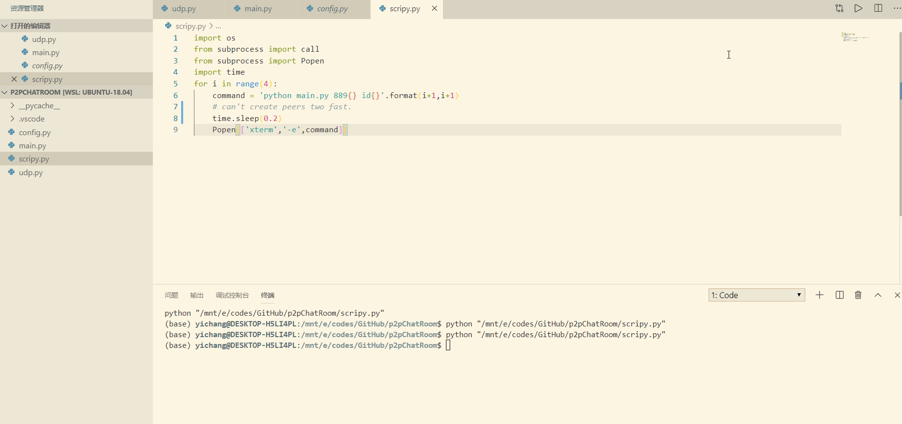
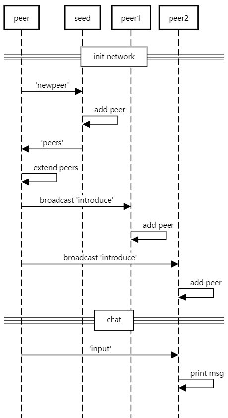

# p2p Chat Room 

It is a fully decentralized p2pChatRoom. No server is needed. It is implemented through python.

## Demo


运行python 脚本一键启动四个节点。

任一节点输入字符串, 广播给所有节点。 

任一节点输入字符串 + id name, 发送给指定节点。 

## Sequence Diagram


项目分为三个阶段：

1，启动网络阶段： 

首先启动种子节点seed，之后启动的节点向 seed 发送启动信息， 种子节点收到信号后，更新peers 列表。 将peers列表放送给新节点。 

新节点收到peers 列表之后，向每个节点介绍自己。 老节点更新自己的peers列表。 

2， 聊天阶段

输入信息时，不指定节点id, 则广播信息。

指定节点id, 则定向发送信息。 

3， 离开阶段

输入exit, 退出。

其他节点在本节点friends列表中删除对应节点。 

### Explanation

script.py 启动4个xterm 做为模拟节点

config.py 配置信息，包括seed 的 ip 和 port. 

udp.py udp 工具包，收发信息的接口。

main.py 主要通讯逻辑。

通讯包的结构:
```
{
    "type":"input",
    "data":"string"
}
```
通过不同的type, 作出不同的响应。 

### Usage

在多个terminal中执行main.py, 启动多个节点。第一个启动的必须是config 中的种子节点。

例如：

python main.py 8891 id1

python main.py 8892 id2

python main.py 8893 id3

然后输入信息进行通信。

"hello"

"hello id2"

"exit"