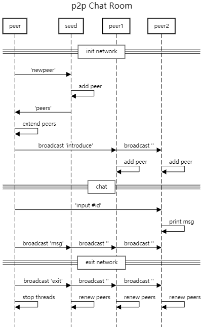

# p2p Chat Room 

It is a fully decentralized p2pChatRoom. No server is needed. It is implemented through python.

## Demo

运行python 脚本一键启动四个节点。

任一节点输入字符串, 广播给所有节点。 

任一节点输入字符串 + id name, 发送给指定节点。 

## Sequence Diagram

项目分为两阶段：

1，启动网络阶段： 首先启动种子节点，之后启动的节点向 seed 发送启动信息， 种子节点收到信号后，更新peers 列表。  

